# naughty-orchestrators-xD 😈🪄

Two custom [Claude Code](https://claude.com/claude-code) skills, packaged as an installable **plugin
marketplace** so they can be shared and replicated across machines with one `/plugin marketplace add`.

| Skill | One-liner |
|---|---|
| **`orchestrate`** | Bootstraps **and** operates a multi-tier *agent orchestration* system in any codebase — scan → infer → generate a tailored `CLAUDE.md` hierarchy, then run a **budget-driven** dispatch loop with a Devil's-Advocate gate and pre/post-implementation validation gates, routing to the **skills, plugin sub-agents, and MCP tools you already have**. |
| **`graphify`** | Turns any folder (code, docs, papers, images) into a navigable **knowledge graph** with community detection and an honest `EXTRACTED`/`INFERRED` audit trail. |

Three things that make it more than a `CLAUDE.md` generator:

- **Budget-driven** — every request resolves a *token budget* (auto from impact, overridable, hard-capped, or `unleash` for unlimited). Agent count/depth scale to the budget via **progressive deepening** instead of a fixed swarm — ~5–15× cheaper on routine work, unboundedly thorough on demand.
- **Capability-aware** — it discovers and *uses what's installed*: thinking skills, plugin **sub-agents** (auto-routes roles → `security-auditor`, `code-architect`, `test-engineer`, …), and **MCP servers** — instead of always spawning generic agents.
- **`orchestrate` × `graphify`** — it can consume a `graphify` graph to make impact assessment and routing *structure-aware* instead of heuristic-only.

Plus a self-contained **interactive visualization** (`/orchestrate visualize`) and a hardened **security model** (untrusted-content handling, injection-safe generation).

---

## Table of contents

- [How they fit together](#how-they-fit-together)
- [Part 1 — `orchestrate`](#part-1--orchestrate)
  - [Two roles](#two-roles-bootstrap--runtime)
  - [The bootstrap pipeline](#the-bootstrap-pipeline)
  - [The 4-tier hierarchy](#the-4-tier-hierarchy)
  - [Impact classification](#impact-classification)
  - [The runtime dispatch loop](#the-runtime-dispatch-loop)
  - [Budget-driven dispatch](#budget-driven-dispatch)
  - [The Devil's-Advocate gate](#the-devils-advocate-gate)
  - [The validation gates](#the-validation-gates)
  - [Capability-aware dispatch](#capability-aware-dispatch)
  - [The visualization](#the-visualization)
  - [Security model](#security-model)
  - [Platform-packs & adaptive Tier-2](#platform-packs--adaptive-tier-2)
- [Part 2 — `graphify`](#part-2--graphify)
- [Part 3 — `orchestrate` × `graphify`](#part-3--orchestrate--graphify)
  - [Why](#why)
  - [The three-layer graph contract](#the-three-layer-graph-contract)
  - [Snapshot-first, live-optional](#snapshot-first-live-optional)
  - [The trust model](#the-trust-model)
  - [A graph-aware request, end to end](#a-graph-aware-request-end-to-end)
- [Install / replicate](#install--replicate)
- [Repo layout](#repo-layout)
- [Command cheat-sheet](#command-cheat-sheet)

---

## How they fit together

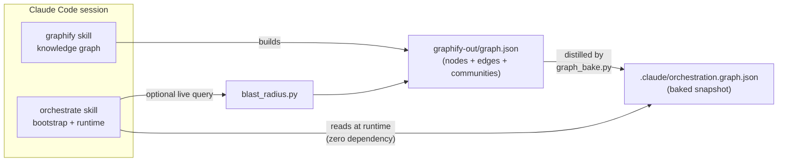

`graphify` produces the graph; `orchestrate` consumes a distilled snapshot of it. Neither hard-depends on the
other — `orchestrate` works fully without `graphify`, and `graphify` is a standalone tool.

---

## Part 1 — `orchestrate`

A skill that **generates** a customized multi-agent system for a repo, and then **is** that system's operating
manual. Instead of one model doing everything, Tier 0 (the root orchestrator) classifies each request, weighs its
risk, runs adversarial + validation gates, and dispatches the work to specialized sub-agents.

### Two roles (bootstrap + runtime)

1. **Bootstrap role** — when you run `/orchestrate`, it scans the project, infers a tech-stack profile, asks a
   few confirmations, and writes a tailored `CLAUDE.md` + per-project Lead files + critics + validators + config.
2. **Runtime role** — the generated root `CLAUDE.md` *inlines* the operating rules. From then on, every request
   in that repo flows through the dispatch loop below.

### The bootstrap pipeline

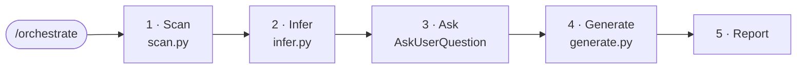

| Step | What it does |
|---|---|
| **Scan** | Detects shape (monorepo vs single-app), frameworks, infrastructure (sockets, queues, cache, ORM, JWT, payments…), domain markers (multi-DB, multi-tenant, growing tables), module boundaries, complexity, and QA scripts. |
| **Infer** | Matches **platform-packs** (`pack.yaml` triggers), picks **adaptive Tier-2** leads for deep projects, derives **impact bumps**. |
| **Ask** | One question at a time — confirm packs, personas, thresholds. |
| **Generate** | Writes the root `CLAUDE.md`, per-project Lead files, the 7 core critics, validators, task-agents, and `.claude/orchestration.config.yaml`. |
| **Report** | Tier-grouped summary of what was installed. |

Modes auto-detected: **Fresh install** (no `CLAUDE.md`) · **Migrate** (existing `CLAUDE.md` it didn't author → merge + back up) · **Update** (config exists → re-scan + diff). Flags: `--express`, `--manual`, `--dry-run`.

### The 4-tier hierarchy

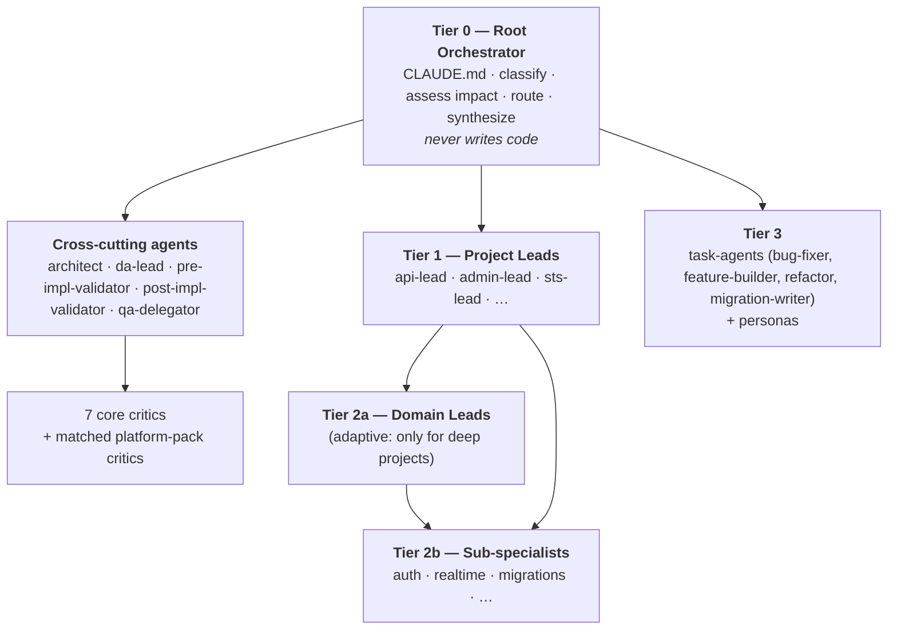

### Impact classification

Every request is scored. The tier decides which gates fire and whether they **block** or merely **advise**:

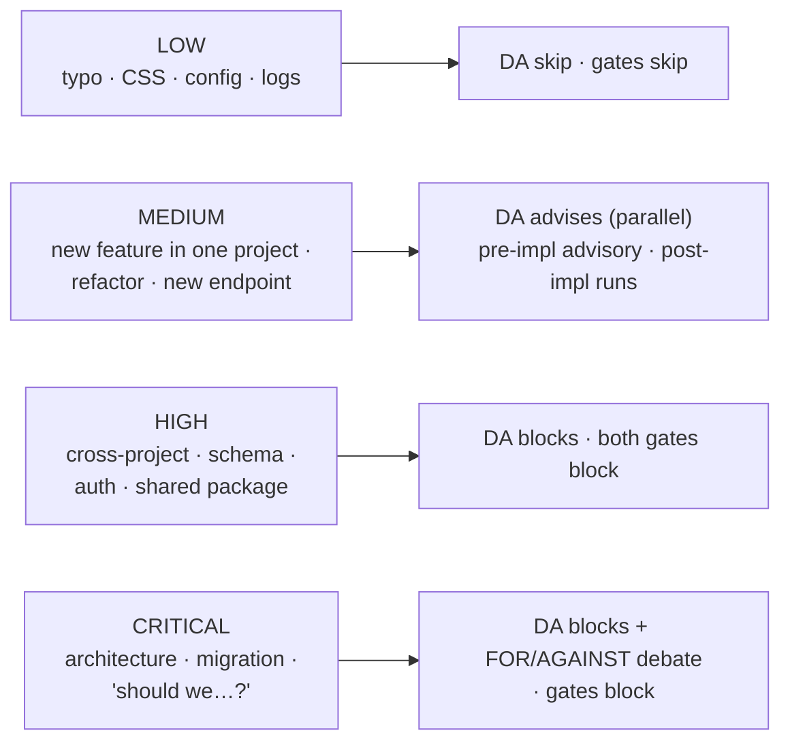

### The runtime dispatch loop

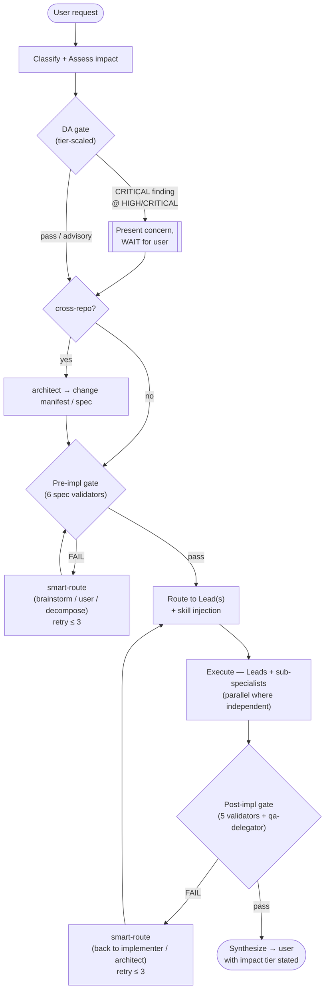

Gate retries are capped at **3 per gate per user message**, with cycle detection (same primary blocker twice →
abort early) and a structured escalation report on exhaustion. Each loop-back carries a *failure-context payload*
(failing validators, `file:line` evidence, suggested remediation, routing rationale).

### Budget-driven dispatch

Agent **count and depth are governed by a token budget**, not a fixed swarm. Every request sits on a dial:
`cheap → impact-default → thorough → unleashed`. This is what makes it affordable by default and unboundedly
thorough on demand. Deterministic core: `scripts/budget.py` (unit-tested); full contract:
`plugins/orchestrate/skills/orchestrate/references/budget-model.md`.

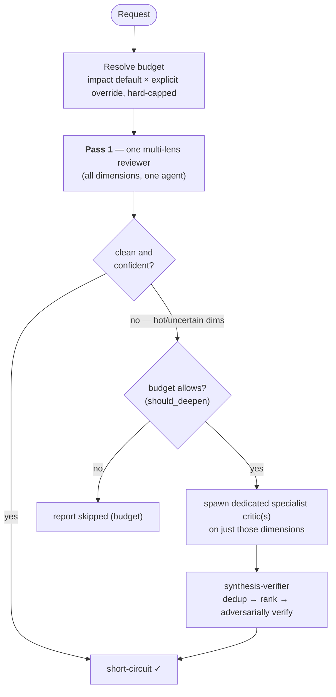

- **Budget** = impact default (`LOW 0 · MEDIUM 150k · HIGH 500k · CRITICAL 1.2m`) × any **explicit** override
  (`keep it cheap` ×0.4 · `be thorough` ×3 · `budget 300k` · `budget +200k` · `unleash` → ∞), clamped to a hard
  session ceiling. `budget.mode: unlimited` makes every request unleashed (for MAX-plan users). The grammar is
  opt-in — bare prose (`max-width`, `deep link`) never rescales spend, and the resolved override is echoed in a
  **spend report** at the end of every response.
- **Progressive deepening** replaces fixed fan-out: one multi-lens reviewer first → dedicated specialist
  "deepeners" only on high-severity / low-confidence dimensions the budget affords → short-circuit when clean.
  Security/auth/data-loss/migrations are **force-deepened** on HIGH/CRITICAL regardless of self-confidence.
- **Unleashed mode** (`∞`) runs the maximal-rigor patterns — full panels, **loop-until-dry**, **multi-attempt
  tournaments**, **perspective-diverse verification** — and terminates on **convergence** (K clean rounds) plus a
  code-enforced agent-ceiling backstop, via the `assets/workflows/unleashed-review.workflow.js` engine.
- **Hybrid execution:** inline self-metering (portable) by default; escalates to a deterministic **Workflow**
  (hard cap / convergence loop) for unleashed, CRITICAL, or large jobs. Cheap model for mechanical/Pass-1 work,
  top model for judgment/debate. Savings are a *distribution*: ~5–15× on clean requests, ~2–4× when findings
  surface, break-even-or-more on CRITICAL/unleashed (intentional).

### The Devil's-Advocate gate

The DA gate runs **progressive deepening**, not an always-on swarm. `da-lead` runs **one multi-lens Pass-1
reviewer** across all dimensions — `edge-case`, `security`, `performance`, `failure-mode`, `consistency`,
`tech-debt`, `alternatives` (always proposes a Plan B), plus any matched **platform-pack** critics
(`cross-tenant-leak`, `jwt-lifecycle`, `socket-fanout`, `multi-db-consistency`, …). The 7 core critics + pack
critics become **on-demand deepeners**, spawned only on dimensions that are risky/uncertain *and* affordable.
A dedicated **`synthesis-verifier`** then dedups → severity-ranks → **adversarially verifies HIGH/CRITICAL
findings before surfacing** (it never silently drops an unprovable CRITICAL), returning one verdict:
**PROCEED / PROCEED-WITH-CHANGES / RECONSIDER**.

### The validation gates

- **Pre-impl** (`pre-impl-validator` → 6 spec validators): `problem-statement`, `requirement-completeness`,
  `success-criteria`, `assumption`, `scope`, `contradiction`. Checks the *spec* before any code.
- **Post-impl** (`post-impl-validator` → 5 + `qa-delegator`): `spec-conformance`, `acceptance-criteria`,
  `diff-scope`, `regression`, `smoke-test`, and `qa-delegator` (wraps the project's real lint/test/typecheck).

On failure each routes to the *right* place — a `problem-statement` blocker goes back to the **user**, a `scope`
blocker back to **brainstorming with a decomposition mandate**, a `regression` blocker back to the **implementing
Lead** with the failing tests, a security finding to the **architect**, etc.

### Capability-aware dispatch

The orchestrator **uses what you already have installed** instead of always spawning generic agents. At bootstrap
(and `/orchestrate update`) it detects three things and wires them into the generated `CLAUDE.md`:

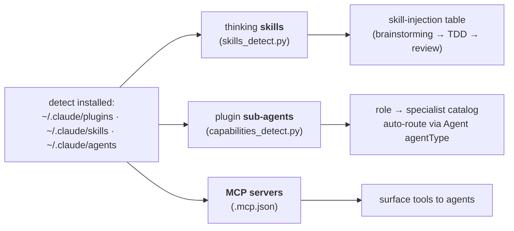

- **Skills** — only references skills actually present (a public user without `superpowers` gets graceful
  built-in / inline fallbacks, never a dangling `superpowers:brainstorming`).
- **Sub-agents** — a **role → specialist catalog** auto-routes orchestration roles to matched installed agents:
  DA security deepener → `security-auditor`, architect → `code-architect`, regression → `test-engineer`,
  failure-mode → `silent-failure-hunter`, types → `type-design-analyzer`, … **falling back to a generic agent**
  when none is installed. So the orchestrator *conducts the specialists you already have*.
- **MCP servers** — surfaced with use-cases (`playwright` → smoke-test validator, `github` → branch/PR prep,
  `context7` → docs lookup) so agents leverage what's connected.

### The visualization

`/orchestrate visualize` (`scripts/visualize.py`) renders the whole system as **one self-contained interactive
HTML file** — inline SVG/CSS/JS, no build, no server, no CDN, opens offline. It always draws the generic
architecture and **overlays the live install** from `.claude/orchestration.config.yaml`. Tabs:

- **Summary** — a discovery dashboard: project shape/language, hierarchy counts, and everything detection found
  (skills · plugin sub-agents + roles auto-routed · MCP servers · budget mode · graphify status).
- **Hierarchy** — pan/zoom tier graph; click a node for its role + defining file + who dispatches it.
- **Dispatch loop** · **Budget engine** (pick an impact tier → resolved budget + allocation bars) ·
  **Capabilities** (role → specialist routing + MCP) · **Graphify**.

### Security model

The skill runs against arbitrary repos, so it treats all repo-derived input as untrusted
(`plugins/orchestrate/skills/orchestrate/references/untrusted-content.md`):

- **Prompt-injection** — repo content (diffs, excerpts, names, graph text, failure evidence) is **data, never
  instructions**; it's fenced when embedded, an embedded verdict/override carries no authority, and budget
  overrides are parsed **only** from the user's own message. Wired into da-lead, synthesis-verifier,
  loop-semantics, and the tier0 template.
- **Generated HTML** is JSON/script-safe + HTML/attribute-escaped (no XSS from a scanned project name);
  **generated files** use traversal-safe path segments, write-containment, sanitized markdown, and single-pass
  templating.
- Scripts use `yaml.safe_load` only — no `eval`/`exec`/`subprocess`/`pickle` — bound the size of files they read,
  and degrade (don't crash) on malformed config. A 17-finding security audit is locked in by regression tests.

### Platform-packs & adaptive Tier-2

- **Platform-packs** (16 bundled) are data — each is a folder with a `pack.yaml` (trigger clauses) + critic
  markdown. Adding one needs no code change; `infer.py` matches triggers against the scan.
- **Adaptive Tier-2**: when a project crosses a complexity threshold (≥ 30 source files **or** ≥ 5 subdomains),
  bootstrap splits its Lead into intermediate **Domain Leads** that orchestrate specialists. Shallow projects stay
  flat to avoid overhead.

---

## Part 2 — `graphify`

Drop anything into a folder and get a structured, persistent knowledge graph. Built around the idea that a graph
surfaces connections you'd never think to ask about directly.

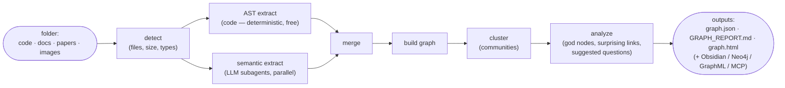

Three things it does that a chat assistant alone cannot:

1. **Persistent graph** — relationships live in `graphify-out/graph.json` and survive across sessions.
2. **Honest audit trail** — every edge is tagged `EXTRACTED` / `INFERRED` / `AMBIGUOUS` with a `confidence_score`.
3. **Cross-document surprise** — community detection finds links between concepts in *different* files.

Query it later: `/graphify query "<q>"` (BFS/DFS traversal), `/graphify path "A" "B"` (shortest path),
`/graphify explain "X"` (everything connected to a node). `--update` re-extracts only changed files; an MCP server
exposes the graph to other agents live. **Runtime dependency:** `pip install graphifyy`.

---

## Part 3 — `orchestrate` × `graphify`

### Why

`orchestrate` makes three decisions *blind* to a codebase's real structure:

- **Impact** is rule-based ("schema change = HIGH") — it can't see the true blast radius of a change.
- **Routing** is path-based ("touches 2+ folders") — it can't see *hidden* coupling (a frontend silently
  consuming an API route/DTO).
- **Tier-2 splitting** uses crude file/subdomain counts — it has no notion of real module communities.

`graphify` produces exactly that missing substrate. The integration is **strictly additive and optional**
(`graph_integration.enabled` in config) — off, or no snapshot present, and behavior is identical to before.

### The three-layer graph contract

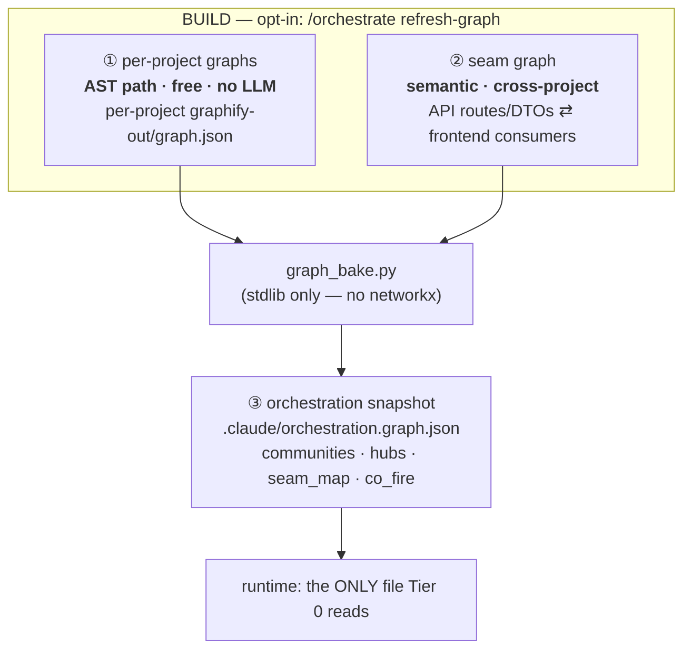

| Layer | Built by | Cost | Powers |
|---|---|---|---|
| Per-project graphs | graphify **AST** (`--directed`) | **free** | within-project blast-radius, hubs, communities |
| Seam graph | targeted **semantic** extraction over a curated contract corpus | bounded | cross-project coupling |
| Snapshot | `graph_bake.py` (pure stdlib) | free | everything runtime reads |

### Snapshot-first, live-optional

Runtime reads the baked snapshot with **zero dependency**. For a request that names specific files, it *may*
escalate to a live query — but never has to.

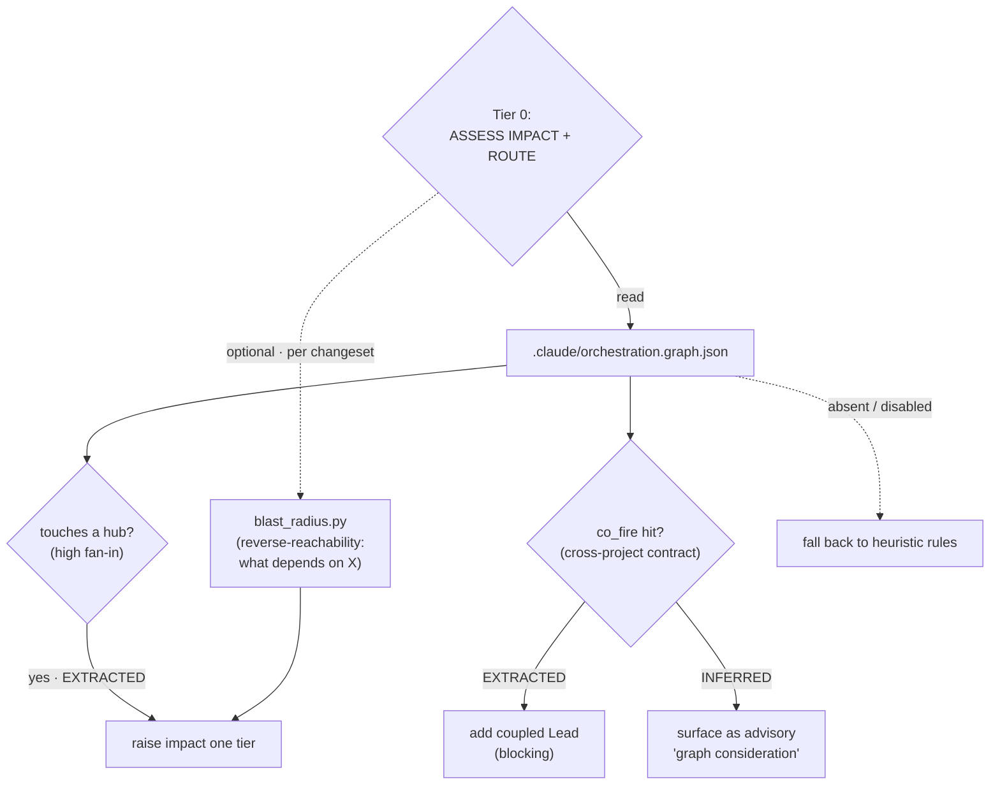

### The trust model

Honest by construction — every snapshot fact carries provenance:

- **`EXTRACTED`** (AST / structural): may **raise** impact and **add** Leads autonomously.
- **`INFERRED`** (semantic / seam): **advisory only** — surfaced as a "graph consideration," never a silent gate.
- The graph **never lowers** impact below the rule-based floor, and every graph-driven adjustment is logged with
  its provenance in the synthesis.

### A graph-aware request, end to end

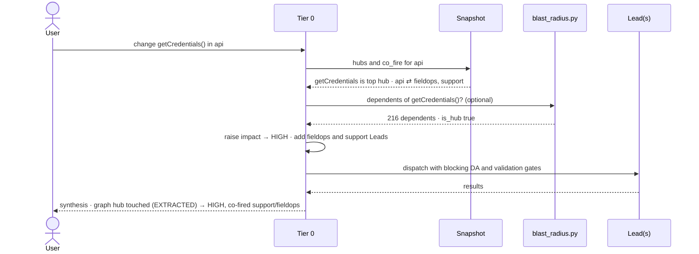

The three scripts that make this work:

| Script | Role | Deps |
|---|---|---|
| `scripts/graph_build.py` | build the free AST per-project graphs; compute the seam contract corpus | graphify (optional) |
| `scripts/graph_bake.py` | distill graphs → the snapshot (communities, hubs by fan-in, seam_map, co_fire) | **stdlib only** |
| `scripts/blast_radius.py` | runtime "what depends on X" + hub check | **stdlib only** |

Full contract, snapshot schema, and degradation matrix: `plugins/orchestrate/skills/orchestrate/references/graph-integration.md`.

---

## Install / replicate

This repo is a **Claude Code plugin marketplace** with two plugins (`orchestrate`, `graphify`):

```
/plugin marketplace add angkoonhian/naughty-orchestrators-xD
/plugin install orchestrate@naughty-orchestrators-xD
/plugin install graphify@naughty-orchestrators-xD
```
```bash
pip install graphifyy        # graphify's runtime dependency
```

Then in any project: `/orchestrate` to bootstrap (the skill is namespaced `orchestrate:orchestrate`), and
(optionally) `/graphify` + `/orchestrate refresh-graph` to turn on graph-aware impact & routing.

**Local development** (test without publishing):

```bash
claude --plugin-dir ./plugins/orchestrate          # load the plugin straight from the repo
cd plugins/orchestrate/skills/orchestrate && python -m pytest scripts/tests/ -q   # 105 tests
```

## Repo layout

```
.
├── .claude-plugin/
│   └── marketplace.json         # lists the two plugins
└── plugins/
    ├── orchestrate/
    │   ├── .claude-plugin/plugin.json
    │   └── skills/orchestrate/
    │       ├── SKILL.md          # entry point: bootstrap + runtime rules
    │       ├── scripts/          # scan · infer · generate · update · migrate
    │       │                     # budget · skills_detect · capabilities_detect · visualize
    │       │                     # graph_build · graph_bake · blast_radius  (+ tests/ — 105 tests)
    │       ├── assets/           # templates, core critics, validators, task-agents,
    │       │                     # cross-cutting (da-lead, synthesis-verifier, …), workflows/
    │       ├── platform-packs/   # 16 domain critic bundles (pack.yaml + critics)
    │       └── references/       # budget-model · loop-semantics · untrusted-content
    │                             # classification-rules · graph-integration · …
    └── graphify/
        ├── .claude-plugin/plugin.json
        └── skills/graphify/
            └── SKILL.md          # full graphify pipeline + query/path/explain/update/MCP
```

## Command cheat-sheet

| Command | What |
|---|---|
| `/orchestrate` | Bootstrap (or migrate/update) the orchestration system for the current repo |
| `/orchestrate --dry-run` | Scan + infer + report, write nothing |
| `/orchestrate visualize` | Render the interactive HTML map (summary + hierarchy + budget + capabilities + graphify) |
| `/orchestrate refresh-graph` | Build per-project + seam graphs and bake the snapshot (opt-in) |
| `/orchestrate add-critic\|add-validator\|add-persona\|add-lead <name>` | Extend the generated system |
| _(per request)_ `keep it cheap` · `be thorough` · `budget 300k` · `unleash` | Dial the token budget for a request |
| `/graphify <path>` | Build a knowledge graph for a folder |
| `/graphify query "<q>"` · `path "A" "B"` · `explain "X"` | Traverse / query the graph |
| `/graphify <path> --update` | Incremental re-extraction of changed files |

---

*Two skills, one toolbox. `orchestrate` decides **who** does the work, **how carefully**, and **within what
budget** — reusing the specialists and tools you already have; `graphify` tells it **what actually depends on
what**. Naughty, but organized. 😈*
